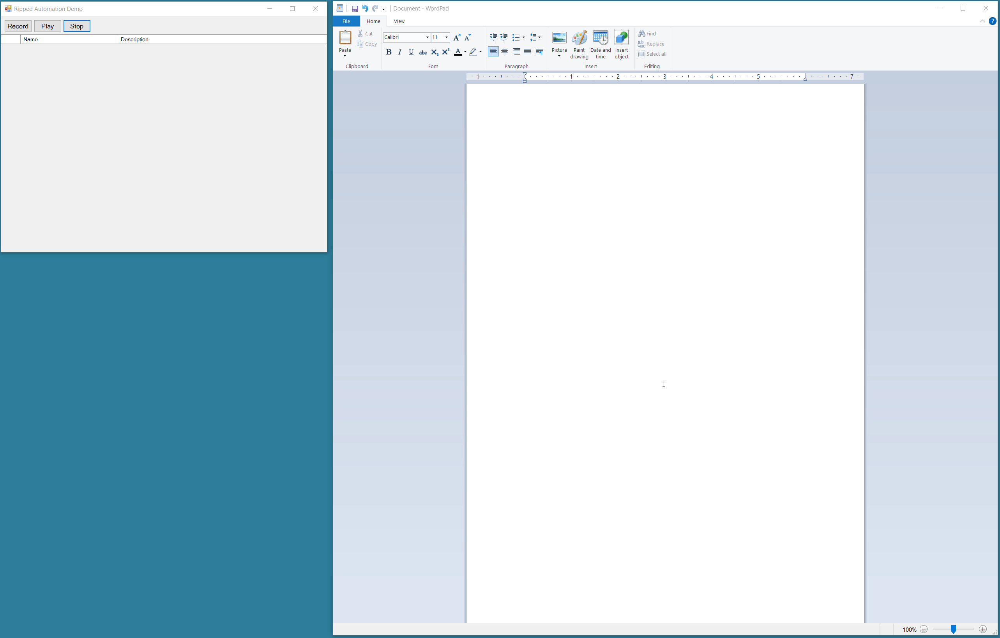

# Ripped Automation
An automation recorder + playback proof of concept leveraging Microsoft's UIAutomationCom.

### Demonstration


### Getting Started

+ The startup project should be ```RippedAutomation.WinFormRecorderUi```.
+ Press ```Record```, and a green rectangle will highlight the element over which you are currently hovered. Use your mouse and keyboard on any Winform / WPF application and your actions will be recorded until you press ```Stop```.
+ Pressing ```Play``` will execute your recorded actions. If an element is not found, then the execution will stop at that action.

### Points of Interest

##### The Recorder
The recorder is an overhauled version of WinAppDriver’s recorder. Their current implementation still needs a ton of TLC, yet shows what is possible. Leftovers still exist in this solution, including rampant statics, yet organization, cleanup, and refactorization have been applied from top to bottom. The meat and potatoes of the recorder (including further explanation) can be found in ```HookEventHandler.cs``` 

> The biggest pitfall in their recorder is the reliance on a C Library called UIXPathLIb. The logic/process used has huge performance pitfalls. This library was converted and refactored into the heart of ```UiAutomationCom.cs```.

That said, a Windows Form had to be leveraged to get an ignorable process Id. You can review ```DemoForm.cs``` to learn how to set up and leverage the ```GenerationClient``` in ```RippedAutomation.Generation```. The demo form shows two ways of handling the ```UiEvents``` being returned by ```GenerationUiEventEventHandler``` - a simplified version and a version that is a bit more robust, waiting for 5 seconds if an element fails before bombing out.

##### Playback
The playback is handled by no external libraries other than those provided by Microsoft. There are pros and cons to this approach. Sadly, the documentation by Microsoft is severely lacking, and trial & error had to be applied. Here, I opted for a static extension class to serve as the backbone. I strongly suggest you improve and refactor this if you leverage it in any production environment.

To playback any action, you’ll need a ```UiEvent```, which can be created manually or generated by the recorder. Simply put, the line that will execute the action/event is ```PlaybackEventExtensions.Execute(new PlaybackEvent(uiEvent));```. There is no caching here, which means that even if the same element is clicked/typed multiple times, the program will have to search and find the element every time before an action is applied. Once a ```PlaybackEvent``` is constructed and used in ```PlaybackEventExtensions```, the code becomes pretty easy to follow. 

> I recommend that you use the recorder to create the ```UiEvents``` then debug/step to understand the overview of the process flow. It’s pretty cool to see it in action and actually work.

##### .NET Framework & Windows
Based off the constraint of ```UIAutomationCom```, I currently do not see a way to move this off .NET or Windows.

#### What's Next 
Investigating TestStackWhite and FlaUI kickstarted me on this project. FlaUI is by far the most active open source project that continues to improve upon Microsoft’s own source. I’ll work on migrating the recorder to generate/integrate playback functionality into their ecosystem.

#### Completed & Supporting Solutions / Alternatives

| Name | Repository |
| ------ | ------ |
| FlaUI | [Github Repository](https://github.com/FlaUI/FlaUI) |
| WinAppDriver | [Github Repository](https://github.com/Microsoft/WinAppDriver) |